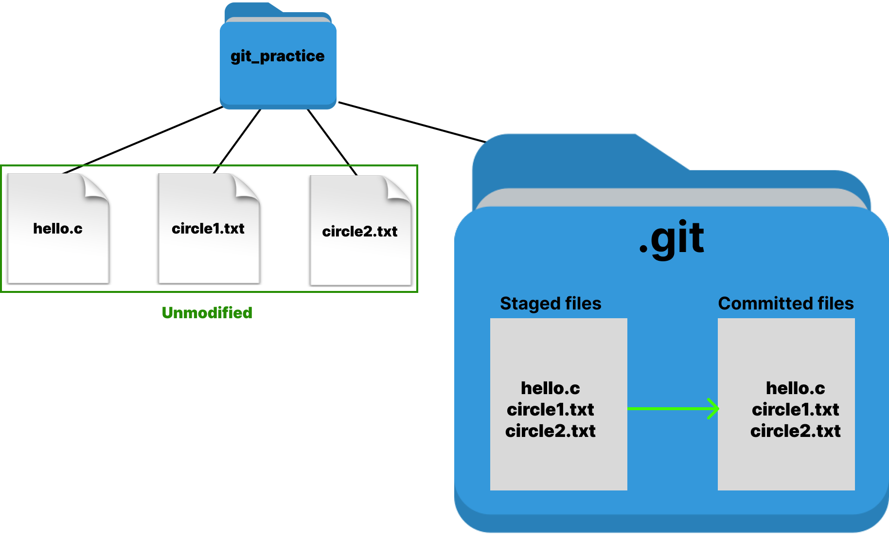

# Fundamentals

## Emacs Interface

The Emacs interface consists of several key components:&#x20;

* **Buffers**: Buffers are the in-memory representation of files, or temporary workspaces for text. Every file you open in Emacs is loaded into a buffer. You can have multiple buffers open, even if they are not visible in any window. Buffers also store changes made to text before you save them to disk.
* **Window**: A window in Emacs displays a buffer. You can have multiple windows open, each showing a different buffer.
* **Frame**: A frame is the entire graphical window that holds one or more Emacs windows.
* **Point**: The point is the current position of the text cursor in a buffer.
* **Mark**: The mark is a temporary position you can set within a buffer, often used for selecting text or defining a region.
* **Region**: A region is a portion of text between the point and the mark.
* **Mode Line**: Located at the bottom of each window, the mode line displays essential information about the buffer shown in that window. It includes the buffer's name, the current [mode(s)](broken-reference), the position of the cursor, and other useful details, such as whether the buffer has unsaved changes.
* **Mini-buffer**: The mini-buffer, located at the bottom of the frame, is a small, temporary window where Emacs prompts you for input, such as when searching for text, entering commands, or specifying file names.

The image below provides a visual illustration of these components.

<figure><figcaption>
Emacs Interface: Visualization of Components
</figcaption></figure>

## Emacs Modes

Emacs operates in various _modes_. Modes provide language-specific or file-format-specific features, such as syntax highlighting, indentation, and code completion, making editing and navigating files easier.&#x20;

Within the scope of COS217, you will primarily work with four modes: C mode, Assembler mode, Text mode, and Fundamental mode. Emacs automatically selects the appropriate mode based on the filename extension:

* .c: C mode
* .s: Assembler mode
* .txt: Text mode
* No extension: Fundamental mode
