# Syntax of Shell Commands

Shell commands typically consist of _fields_, which represent a _command name_ followed by one or more _arguments_.&#x20;

## **Command name**

A command name typically represents an executable file or a shell _built-in_, but it can also represent a _function_.&#x20;

* **Executable file**: An executable file represent any programs on the filesystem, though it typically represents a utility. There is no fundamental distinction between a utility and a regular program, except that a utility can be called by name alone (rather than _pathname_).
* **Shell built-In**: A shell built-in is a utility implemented within the shell. The difference between a shell built-in and another program is that a shell built-in represents a service provided by the shell itself, while other programs represent services provided by external programs. The practical implications of this distinction are typically not of concern to programmers, so we will not cover them here. However, whenever the distinction is pertinent, we will point it out.&#x20;
* **Function**: A function is essentially a group of commands that are defined for reuse.&#x20;

## **Argument**

An argument is a parameter passed to the executable file, shell built-in, or function. It typically represents an _option_ or an _operand_, but it can also represent an _option-argument_.&#x20;

*   **Option**: An option is an argument that changes the command's default behavior. An option normally consists of a single character prefixed by a hyphen (e.g., `-a`), but it can also consist of a full word prefixed by two hyphens (i.e., `--list`). The former is called a _short option_, and the latter is called a _long option_. &#x20;

    Options are defined and interpreted by the program they are supplied to. Thus, the precise syntax and behavior of an option are dependent on the program, not the shell. Many commands allow several short options to be combined.&#x20;
* **Option-Argument**: An option-argument is a parameter that follows certain options. For example, the `-o` option in the `gcc` command uses an argument—an output filename such as `hello`.
* **Operand**: An operand specifies the data that the command manipulates or operates on, usually representing a literal, variable, or filename. (Note that in this context we use the term _file_ broadly to include directories.) Commands often allow multiple operands to be supplied together. The order of options and operands can be significant, depending on the command.&#x20;

The syntax of a shell command can generally be summarized as follows:

```css
COMMAND_NAME OPTION(S) OPERAND(S)
```

The complete syntactical structure is illustrated in Figure 1.&#x20;

<figure><figcaption></figcaption></figure>
