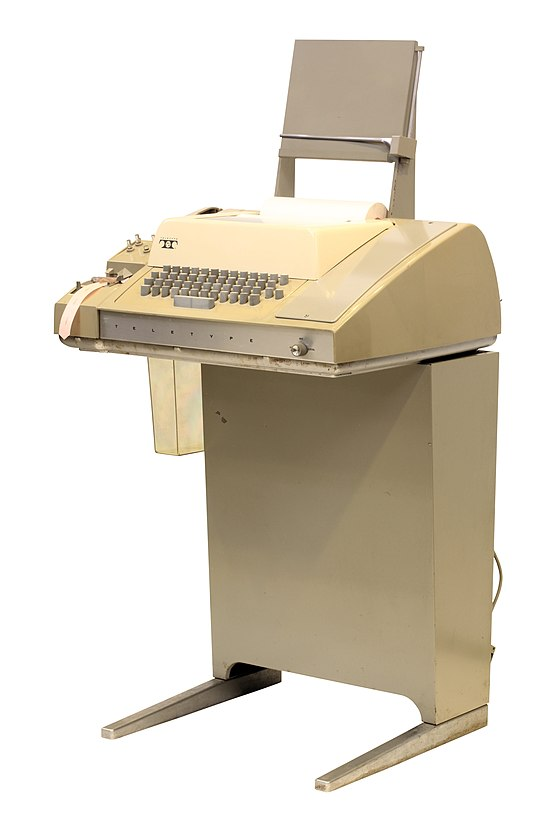

# Introduction

The command-line interface (CLI) is a text-based method of interacting with your computer. Unlike the graphical user interfaces (GUIs) that allow you to issue commands by clicking buttons and icons, a CLI requires you to issue commands by typing typing sequences of text in a [terminal](broken-reference).&#x20;

Imagine using a CLI as if you're texting with your computer: you type in your request, and it responds  with text output. Let's consider a couple of examples of computer interaction to highlight the distinction between a GUI and CLI.&#x20;

In this chapter, will focus on command line interface to Linux.


Given the much steeper learning curve of the CLI compared to the GUI, you might wonder why anyone uses the CLI over a GUI. Here's a few reasons:

* **Speed:** Once you're familiar with commands, the CLI can be much faster than using a mouse.
* **Automation:** The CLI makes it easy to automate repetitive tasks.
* **Remote Access:** Remote computer interaction is much more efficient in a CLI environment.&#x20;
* **Necessity:** Some CLI commands have no GUI equivalent.


## erminal

CLI commands are issued via a _terminal_. In the nascent days of interactive computing, terminals were hardware devices, consisting of a keyboard and a display unit. The first terminals were teletype machines, such as the Model 33 ASR shown in Figure 1, whose display unit was a paper-roll printer.

<figure><figcaption>
Figure 1: Teletype Model 33 ASR
</figcaption></figure>

Teletypes fell out of use in the 1970s with the advent of video display terminals, such as the DEC VT100 shown in Figure 2, which provided instant user-feedback and editing capabilities.&#x20;

<figure><figcaption></figcaption></figure>

Today, hardware terminals are largely obsolete. The predominant method for accessing the CLI is through a _terminal emulator_, which is a GUI program that simulates the functionality of a hardware terminal. An example of a terminal emulator is macOS's Terminal, shown in Figure 3.&#x20;

<figure><figcaption>
Figure 3: macOS Terminal Application
</figcaption></figure>

## Shell
