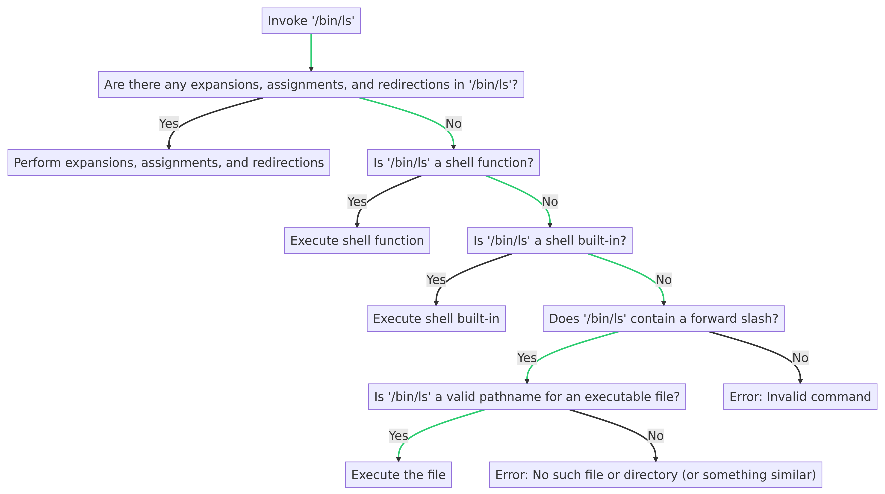
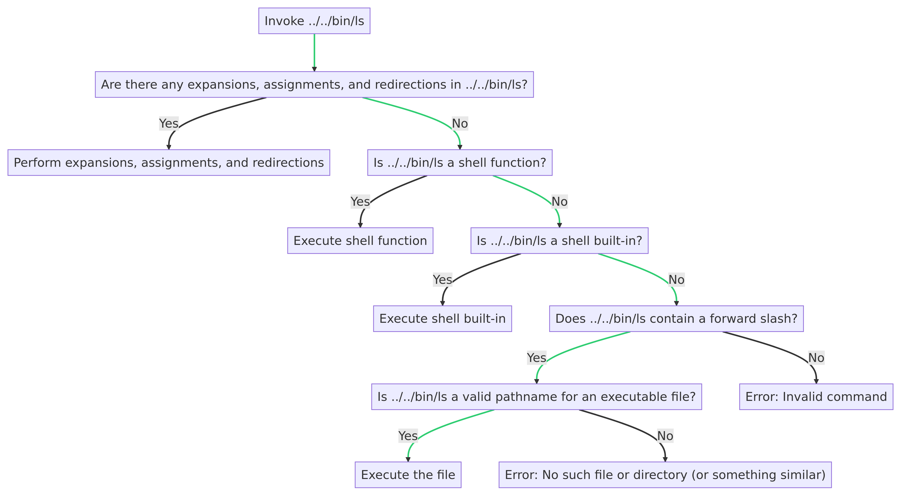
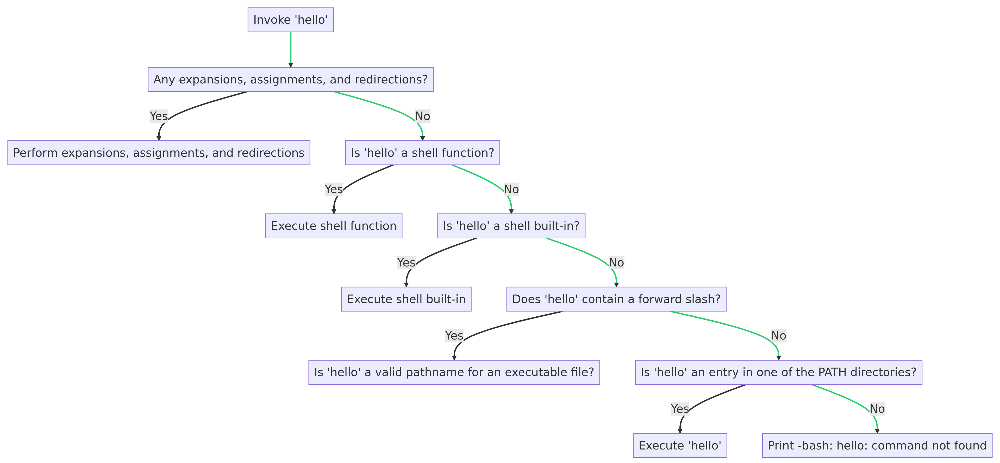
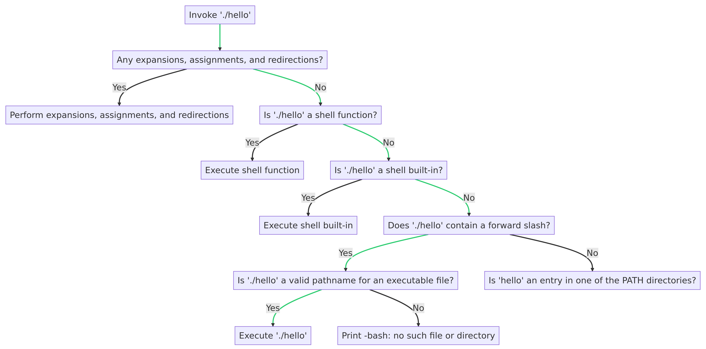
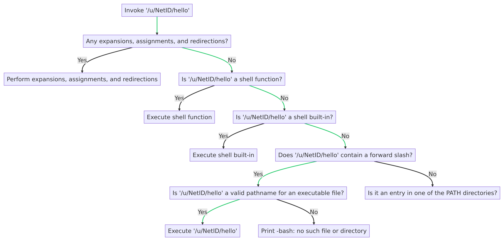

# How Bash Executes Cammands

The job of a shell is to find and run commands. Whenever a command is invoked, Bash goes through the following steps to execute the command:

1. Performs expansions (such as alias expansion), assignments, and redirections. Assuming after these actions there is a resulting command name, Bash will search for the command in the following order:
   1. Search for a function that matches the command name.
   2. Searches for a shell built-in matching command name.&#x20;

If either of these searches is successful, the shell will execute the command. Otherwise, there are two cases to consider:

1. The command name contains a forward slash (/) (e.g., `/bin/ls`, `../../bin/ls`, etc.).
2. The command name does not contain a forward slash (e.g., `ls`).

In case 1, the command name is interpreted as the (absolute or relative) pathname, and Bash will look for an executable file in the specified pathname. If such a file exists, Bash will execute it. If not, Bash will return an error.

In case 2, Bash searches the directories listed in the PATH environment variable for a filename that matches the command name. If it finds a file with the specified name, Bash will execute it. If not, Bash will return an error.

The PATH environment variable is a variable that specifies the directories the shell should search to find an executable file when there is no / in the program name. By default, the PATH variable usually contains the following directories.

* _/usr/bin_
* _/usr/sbin_
* _/usr/local/bin_
* _/usr/local/sbin_
* _/bin_
* _/sbin_

Thus, when users invoke programs such as `logname`, `hostname`, or `cal`, the shell searches for these programs in the directories listed in `$PATH`. You could also invoke these programs using their absolute or relative pathnames, of course.&#x20;

This shell behavior is often a source of confusion for command-line beginners. Say the executable hello is located in the working directory. Invoking hello will not work, even though it is a valid (relative) pathname–the error “No such file or directory” will be returned.&#x20;

The reason, as we just explained, is that the shell will only search the directories listed in $PATH when a program is invoked without a / in its name. Even if the program is located in the working directory, it still must be invoked using a /. A useful “trick” to invoke hello with a / is to trivially insert a /, as so: ./hello. Because `.` references the working directory, it essentially has no effect on the command other than inserting a /.&#x20;

To see which directories are currently registered under PATH, open a terminal and run `Echo $PATH`.&#x20;

## Examples

To illustrate this idea concretely, here are some examples showing the steps Bash takes when commands are invoked. In the following examples, assume the working directory is _/u/yourNetID._

**Case 1**: Suppose you invoke `/bin/ls`. Bash will perform the following checks:

1. Are there any expansions, assignments, and redirections in _/bin/ls_? :heavy\_multiplication\_x:
2. Is `/bin/ls` a shell function? :heavy\_multiplication\_x:
3. Is `/bin/ls` a shell built-in?  :heavy\_multiplication\_x:
4. Does `/bin/ls` contain a forward slash? :heavy\_check\_mark:
5. Is `/bin/ls` an executable file?  :heavy\_check\_mark:
6. Execute it.

<figure><figcaption></figcaption></figure>

**Case 2:** Invoking `../../bin/ls`:&#x20;

1. Any expansions, assignments, and redirections? :heavy\_multiplication\_x:
2. Is `../../bin/ls` a shell function? :heavy\_multiplication\_x:
3. Is `../../bin/ls` a shell built-in?  :heavy\_multiplication\_x:
4. Does `../../bin/ls` contain a forward slash? :heavy\_check\_mark:
5. Is `../../bin/ls` a valid pathname for an executable file?  :heavy\_check\_mark:
6. Execute it.

<figure><figcaption></figcaption></figure>

**Case 3**: Invoking `ls`:&#x20;

1. Any expansions, assignments, and redirections? :heavy\_check\_mark:&#x20;
2. Expand ls to ls -a. Use the _first word_ of `ls -a` (i.e., `ls`) as the command name.
3. Is `ls` a shell function? :heavy\_multiplication\_x:
4. Is `ls` a shell built-in?  :heavy\_check\_mark:
5. Execute it.

<figure><figcaption></figcaption></figure>

**Case 4**: Invoking `hello`:

1. Any expansions, assignments, and redirections? :heavy\_multiplication\_x:
2. Is `hello` a shell function? :heavy\_multiplication\_x:
3. Is `hello` a shell built-in?  :heavy\_multiplication\_x:
4. Does `hello` contain a forward slash? :heavy\_multiplication\_x:
5. Is `hello` an entry in one of the PATH directories? :heavy\_multiplication\_x:
6. Print `-bash: hello: command not found`.

<figure><figcaption></figcaption></figure>

**Case 5**: Invoking `./hello`:

* Any expansions, assignments, and redirections? :heavy\_multiplication\_x:
* Is `./hello` a shell function? :heavy\_multiplication\_x:
* Is `./hello` a shell built-in?  :heavy\_multiplication\_x:
* Does `./hello` contain a forward slash? :heavy\_check\_mark:
* Is `./hello` a valid pathname for an executable file? :heavy\_check\_mark:
* Execute `./hello`.

<figure><figcaption></figcaption></figure>

**Case 6**: Invoking `/u/NetID/hello`:

* Any expansions, assignments, and redirections? :heavy\_multiplication\_x:
* Is `/u/NetID/hello` a shell function? :heavy\_multiplication\_x:
* Is `/u/NetID/hello` a shell built-in?  :heavy\_multiplication\_x:
* Does `/u/NetID/hello` contain a forward slash? :heavy\_check\_mark:
* Is `/u/NetID/hello` a valid pathname for an executable file?:heavy\_check\_mark:
* Execute `/u/NetID/hello`.

<figure><figcaption></figcaption></figure>
